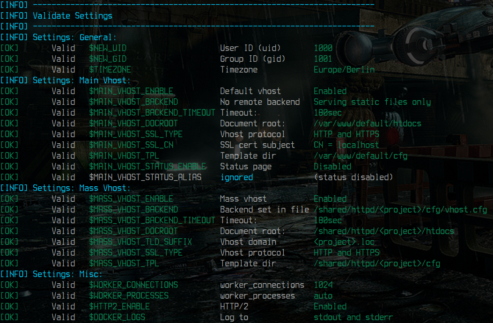

# Nginx stable

[](https://github.com/devilbox/docker-nginx-stable/releases)
[](https://github.com/devilbox/docker-nginx-stable)
[](https://github.com/devilbox/docker-nginx-stable/actions?query=workflow%3Alint)
[](https://github.com/devilbox/docker-nginx-stable/actions?query=workflow%3Abuild)
[](https://github.com/devilbox/docker-nginx-stable/actions?query=workflow%3Anightly)
[](https://opensource.org/licenses/MIT)

[](https://discord.gg/2wP3V6kBj4)
[](https://devilbox.discourse.group)


**Available Architectures:**  `amd64`, `arm64`, `386`, `arm/v7`, `arm/v6`

[](https://hub.docker.com/r/devilbox/nginx-stable)

This image is based on the official **[Nginx](https://hub.docker.com/_/nginx)** Docker image and extends it with the ability to have **virtual hosts created automatically**, as well as **adding SSL certificates** when creating new directories. For that to work, it integrates two tools that will take care about the whole process: **[watcherd](https://github.com/devilbox/watcherd)** and **[vhost-gen](https://github.com/devilbox/vhost-gen)**.

From a users perspective, you mount your local project directory into the container under `/shared/httpd`. Any directory then created in your local project directory wil spawn a new virtual host by the same name. Each virtual host optionally supports a generic or custom backend configuration (**static files**, **PHP-FPM** or **reverse proxy**).

**HTTP/2 is enabled by default for all SSL connections.**

For convenience the entrypoint script during `docker run` provides a pretty decent **validation and documentation** about wrong user input and suggests steps to fix it.

|  |  |  |  |
|:----------------------:|:------------------:|:-------------:|:--------:|
| Invalid backend string | Backend Suggestion | Invalid Alias | Verified |


> ##### 🐱 GitHub: [devilbox/docker-nginx-stable](https://github.com/devilbox/docker-nginx-stable)

| Web Server Project  | Reference Implementation |
|:-------------------:|:------------------------:|
| <a title="Docker Nginx" href="https://github.com/devilbox/docker-nginx-stable" ></a> | <a title="Devilbox" href="https://github.com/cytopia/devilbox" ></a> |
| Streamlined Webserver images | The [Devilbox](https://github.com/cytopia/devilbox) |

**[Apache 2.2](https://github.com/devilbox/docker-apache-2.2) | [Apache 2.4](https://github.com/devilbox/docker-apache-2.4) | Nginx stable | [Nginx mainline](https://github.com/devilbox/docker-nginx-mainline)**

----


## 🐋 Available Docker tags

[](https://hub.docker.com/r/devilbox/nginx-stable)

[`latest`][tag_latest] [`debian`][tag_debian] [`alpine`][tag_alpine]
```bash
docker pull devilbox/nginx-stable
```

[tag_latest]: https://github.com/devilbox/docker-nginx-stable/blob/master/Dockerfiles/Dockerfile.latest
[tag_debian]: https://github.com/devilbox/docker-nginx-stable/blob/master/Dockerfiles/Dockerfile.debian
[tag_alpine]: https://github.com/devilbox/docker-nginx-stable/blob/master/Dockerfiles/Dockerfile.alpine


#### Rolling releases

The following Docker image tags are rolling releases and are built and updated every night.

[](https://github.com/devilbox/docker-nginx-stable/actions?query=workflow%3Anightly)

| Docker Tag                       | Git Ref      |  Available Architectures                      |
|----------------------------------|--------------|-----------------------------------------------|
| **[`latest`][tag_latest]**       | master       |  `amd64`, `i386`, `arm64`, `arm/v7`, `arm/v6` |
| [`debian`][tag_debian]           | master       |  `amd64`, `i386`, `arm64`, `arm/v7`, `arm/v6` |
| [`alpine`][tag_alpine]           | master       |  `amd64`, `i386`, `arm64`, `arm/v7`, `arm/v6` |


#### Point in time releases

The following Docker image tags are built once and can be used for reproducible builds. Its version never changes so you will have to update tags in your pipelines from time to time in order to stay up-to-date.

[](https://github.com/devilbox/docker-nginx-stable/actions?query=workflow%3Abuild)

| Docker Tag                       | Git Ref      |  Available Architectures                      |
|----------------------------------|--------------|-----------------------------------------------|
| **[`<tag>`][tag_latest]**        | git: `<tag>` |  `amd64`, `i386`, `arm64`, `arm/v7`, `arm/v6` |
| [`<tag>-debian`][tag_debian]     | git: `<tag>` |  `amd64`, `i386`, `arm64`, `arm/v7`, `arm/v6` |
| [`<tag>-alpine`][tag_alpine]     | git: `<tag>` |  `amd64`, `i386`, `arm64`, `arm/v7`, `arm/v6` |

> 🛈 Where `<tag>` refers to the chosen git tag from this repository.<br/>
> ⚠ **Warning:** The latest available git tag is also build every night and considered a rolling tag.


## ✰ Features

> 🛈 For details see **[Documentation: Features](doc/features.md)**

### Automated virtual hosts

Virtual hosts are created automatically, simply by creating a new project directory (inside or outside of the container). This allows you to quickly create new projects and work on them in your IDE without the hassle of configuring the web server.

### Automated PHP-FPM setup

PHP is not included in the provided images, but you can link the Docker container to a PHP-FPM image with any PHP version. This allows you to easily switch PHP versions and choose one which is currently required.

### Automated Reverse Proxy setup

Each virtual host can specify its own custom backend. You could for instance serve two NodeJS applications, one Python service and 4 PHP projects, as well as a few that only provide static files. This configuration is applied automatically based on environment variables.

### Automated SSL certificate generation

SSL certificates are generated automatically for each virtual host to allow you to develop over HTTP and HTTPS.

### Automatically trusted HTTPS

SSL certificates are signed by a certificate authority (which is also being generated). The CA file can be mounted locally and imported into your browser, which allows you to automatically treat all generated virtual host certificates as trusted.

### Customization per virtual host

Each virtual host can individually be fully customized via [`vhost-gen`](https://github.com/devilbox/vhost-gen) templates.

### Customization for the default virtual host

The default virtual host is also treated differently from the auto-generated mass virtual hosts. You can choose to disable it or use it for a generic overview page for all of your created projects.

### Local file system permission sync

File system permissions of files/dirs inside the running Docker container are synced with the permission on your host system. This is accomplished by specifying a user- and group-id to the `docker run` command.


## ∑ Environment Variables

The provided Docker images add a lot of injectables in order to customize it to your needs. See the table below for a brief overview.

> 🛈 For details see **[Documentation: Environment variables](doc/environment-variables.md)**
>
> If you don't feel like reading the documentation, simply try out your `docker run` command and add
> any environment variables specified below. The validation will tell you what you might have done wrong,
> how to fix it and what the meaning is.

<table>
 <tr valign="top" style="vertical-align:top">
  <td>
   <strong>Verbosity</strong><br/>
   <code><a href="doc/environment-variables.md#-debug_entrypoint" >DEBUG_ENTRYPOINT</a></code><br/>
   <code><a href="doc/environment-variables.md#-debug_runtime" >DEBUG_RUNTIME</a></code><br/>
  </td>
  <td>
   <strong>System</strong><br/>
   <code><a href="doc/environment-variables.md#-new_uid" >NEW_UID</a></code><br/>
   <code><a href="doc/environment-variables.md#-new_gid" >NEW_GID</a></code><br/>
   <code><a href="doc/environment-variables.md#-timezone" >TIMEZONE</a></code><br/>
  </td>
  <td>
   <strong>Nginx</strong><br/>
   <code><a href="doc/environment-variables.md#-worker_connections" >WORKER_CONNECTIONS</a></code><br/>
   <code><a href="doc/environment-variables.md#-worker_processes" >WORKER_PROCESSES</a></code><br/>
  </td>
 </tr>
 <tr valign="top" style="vertical-align:top">
  <td>
   <strong>Main Vhost</strong><br/>
   <code><a href="doc/environment-variables.md#-main_vhost_enable" >MAIN_VHOST_ENABLE</a></code><br/>
   <code><a href="doc/environment-variables.md#-main_vhost_aliases_allow" >MAIN_VHOST_ALIASES_ALLOW</a></code><br/>
   <code><a href="doc/environment-variables.md#-main_vhost_aliases_deny" >MAIN_VHOST_ALIASES_DENY</a></code><br/>
   <code><a href="doc/environment-variables.md#-main_vhost_backend" >MAIN_VHOST_BACKEND</a></code><br/>
   <code><a href="doc/environment-variables.md#-main_vhost_backend_timeout" >MAIN_VHOST_BACKEND_TIMEOUT</a></code><br/>
   <code><a href="doc/environment-variables.md#-main_vhost_docroot_dir" >MAIN_VHOST_DOCROOT_DIR</a></code><br/>
   <code><a href="doc/environment-variables.md#-main_vhost_template_dir" >MAIN_VHOST_TEMPLATE_DIR</a></code><br/>
   <code><a href="doc/environment-variables.md#-main_vhost_ssl_type" >MAIN_VHOST_SSL_TYPE</a></code><br/>
   <code><a href="doc/environment-variables.md#-main_vhost_ssl_cn" >MAIN_VHOST_SSL_CN</a></code><br/>
   <code><a href="doc/environment-variables.md#-main_vhost_status_enable" >MAIN_VHOST_STATUS_ENABLE</a></code><br/>
   <code><a href="doc/environment-variables.md#-main_vhost_status_alias" >MAIN_VHOST_STATUS_ALIAS</a></code><br/>
  </td>
  <td>
   <strong>Mass Vhost</strong><br/>
   <code><a href="doc/environment-variables.md#-mass_vhost_enable" >MASS_VHOST_ENABLE</a></code><br/>
   <code><a href="doc/environment-variables.md#-mass_vhost_aliases_allow" >MASS_VHOST_ALIASES_ALLOW</a></code><br/>
   <code><a href="doc/environment-variables.md#-mass_vhost_aliases_deny" >MASS_VHOST_ALIASES_DENY</a></code><br/>
   <code><a href="doc/environment-variables.md#-mass_vhost_backend" >MASS_VHOST_BACKEND</a></code><br/>
   <code><a href="doc/environment-variables.md#-mass_vhost_backend_timeout" >MASS_VHOST_BACKEND_TIMEOUT</a></code><br/>
   <code><a href="doc/environment-variables.md#-mass_vhost_docroot_dir" >MASS_VHOST_DOCROOT_DIR</a></code><br/>
   <code><a href="doc/environment-variables.md#-mass_vhost_template_dir" >MASS_VHOST_TEMPLATE_DIR</a></code><br/>
   <code><a href="doc/environment-variables.md#-mass_vhost_ssl_type" >MASS_VHOST_SSL_TYPE</a></code><br/>
   <code><a href="doc/environment-variables.md#-mass_vhost_tld_suffix" >MASS_VHOST_TLD_SUFFIX</a></code><br/>
  </td>
  <td>
   <strong>All Vhosts</strong><br/>
   <code><a href="doc/environment-variables.md#-docker_logs" >DOCKER_LOGS</a></code><br/>
   <code><a href="doc/environment-variables.md#-http2_enable" >HTTP2_ENABLE</a></code><br/>
  </td>
 </tr>
</table>


## 📂 Volumes

The provided Docker images offer the following internal paths to be mounted to your local file system.

> 🛈 For details see **[Documentation: Volumes](doc/volumes.md)**

<table>
 <tr>
  <th>Data dir</th>
  <th>Config dir</th>
 </tr>
 <tr valign="top" style="vertical-align:top">
  <td>
   <code>/var/www/default/</code><br/>
   <code>/shared/httpd/</code><br/>
   <code>/ca/</code><br/>
  </td>
  <td>
   <code>/etc/httpd-custom.d/</code><br/>
   <code>/etc/vhost-gen.d/</code><br/>
  </td>
  </td>
 </tr>
</table>


## 🖧 Exposed Ports

When you plan on using `443` you should enable automated SSL certificate generation.

| Docker | Description |
|--------|-------------|
| 80     | HTTP listening Port |
| 443    | HTTPS listening Port |


## 💡 Examples

In order to get you started easily, the documentation provides many examples about common use cases.

### Serve static files

This example creates the main (default) vhost, which only serves static files.

> See [**Documentation:** Serve static files](doc/examples.md#-serve-staticfiles)


### Serve PHP files with PHP-FPM

This example creates the main (default) vhost, which contacts a remote PHP-FPM host to serve PHP files.

> See [**Documentation:** Serve PHP files with PHP-FPM](doc/examples.md#-serve-php-files-with-php-fpm)


### Serve PHP files with PHP-FPM and sync local permissions

The same as the previous example, but also ensures that you can edit files locally and have file ownerships synced with webserver and PHP-FPM container.

> See [**Documentation**: Serve PHP files with PHP-FPM over HTTPS](doc/examples.md#-serve-php-files-with-php-fpm-over-https)


### Serve PHP files with PHP-FPM over HTTPS

The same as the previous example, just with the addition of enabling SSL (HTTPS).

This example shows the SSL type `redir`, which makes the webserver redirect any HTTP requests to HTTPS.

Additionally we are mounting the `./ca` directory into the container under `/ca`. After startup you will find generated Certificate Authority files in there, which you could import into your browser.

> See [**Documentation:** Serve PHP files with PHP-FPM over HTTPS](doc/examples.md#-serve-php-files-with-php-fpm-over-https)


### Act as a Reverse Proxy for NodeJS

This example creates a NodeJS application running in a Node container and uses the webserver to proxy all requests to the NodeJS application.  You could also enable SSL on the webserver in order to access NodeJS via HTTPS.

> See [**Documentation:** Act as a Reverse Proxy for NodeJS](doc/examples.md#-act-as-a-reverse-proxy-for-nodejs)


### Fully functional LEMP stack with Mass vhosts

The following example creates a dynamic setup. Each time you create a new project directory below the `www/` directory, a new virtual host is automatically being created.

Additionally all projects will have the `.com` suffix added to their domain name, which results in `<project>.com` as the final domain _(Where `<project>` is a placeholder for the created project directory)_.

> See [**Documentation:** Fully functional LEMP stack with Mass vhosts](doc/examples.md#-fully-functional-lemp-stack-with-mass-vhosts)


### Docker Compose

Have a look at the **[examples](examples/)** directory. It is packed with all kinds of `Docker Compose` examples:

* SSL
* PHP-FPM remote server
* Python and NodeJS Reverse Proxy
* Mass virtual hosts
* Mass virtual hosts with PHP-FPM, Python and NodeJS as backends


## 🖤 Sister Projects

Show some love for the following sister projects.

<table>
 <tr>
  <th>🖤 Project</th>
  <th>🐱 GitHub</th>
  <th>🐋 DockerHub</th>
 </tr>
 <tr>
  <td><a title="Devilbox" href="https://github.com/cytopia/devilbox" ></a></td>
  <td><a href="https://github.com/cytopia/devilbox"><code>Devilbox</code></a></td>
  <td></td>
 </tr>
 <tr>
  <td><a title="Docker PHP-FMP" href="https://github.com/devilbox/docker-php-fpm" ></a></td>
  <td><a href="https://github.com/devilbox/docker-php-fpm"><code>docker-php-fpm</code></a></td>
  <td><a href="https://hub.docker.com/r/devilbox/php-fpm"><code>devilbox/php-fpm</code></a></td>
 </tr>
 <tr>
  <td><a title="Docker PHP-FMP-Community" href="https://github.com/devilbox/docker-php-fpm-community" ></a></td>
  <td><a href="https://github.com/devilbox/docker-php-fpm-community"><code>docker-php-fpm-community</code></a></td>
  <td><a href="https://hub.docker.com/r/devilbox/php-fpm-community"><code>devilbox/php-fpm-community</code></a></td>
 </tr>
 <tr>
  <td><a title="Docker MySQL" href="https://github.com/devilbox/docker-mysql" ></a></td>
  <td><a href="https://github.com/devilbox/docker-mysql"><code>docker-mysql</code></a></td>
  <td><a href="https://hub.docker.com/r/devilbox/mysql"><code>devilbox/mysql</code></a></td>
 </tr>
 <tr>
  <td></td>
  <td>
   <a href="https://github.com/devilbox/docker-apache-2.2"><code>docker-apache-2.2</code></a><br/>
   <a href="https://github.com/devilbox/docker-apache-2.4"><code>docker-apache-2.4</code></a><br/>
   <a href="https://github.com/devilbox/docker-nginx-stable"><code>docker-nginx-stable</code></a><br/>
   <a href="https://github.com/devilbox/docker-nginx-mainline"><code>docker-nginx-mainline</code></a>
  </td>
  <td>
   <a href="https://hub.docker.com/r/devilbox/apache-2.2"><code>devilbox/apache-2.2</code></a><br/>
   <a href="https://hub.docker.com/r/devilbox/apache-2.4"><code>devilbox/apache-2.4</code></a><br/>
   <a href="https://hub.docker.com/r/devilbox/nginx-stable"><code>devilbox/nginx-stable</code></a><br/>
   <a href="https://hub.docker.com/r/devilbox/nginx-mainline"><code>devilbox/nginx-mainline</code></a>
  </td>
 <tr>
  <td><a title="Bind DNS Server" href="https://github.com/cytopia/docker-bind" ></a></td>
  <td><a href="https://github.com/cytopia/docker-bind"><code>docker-bind</code></a></td>
  <td><a href="https://hub.docker.com/r/cytopia/bind"><code>cytopia/bind</code></a></td>
 </tr>
 </tr>
</table>


## 👫 Community

In case you seek help, go and visit the community pages.

<table width="100%" style="width:100%; display:table;">
 <thead>
  <tr>
   <th width="33%" style="width:33%;"><h3><a target="_blank" href="https://devilbox.readthedocs.io">📘 Documentation</a></h3></th>
   <th width="33%" style="width:33%;"><h3><a target="_blank" href="https://discord.gg/2wP3V6kBj4">🎮 Discord</a></h3></th>
   <th width="33%" style="width:33%;"><h3><a target="_blank" href="https://devilbox.discourse.group">🗪 Forum</a></h3></th>
  </tr>
 </thead>
 <tbody style="vertical-align: middle; text-align: center;">
  <tr>
   <td>
    <a target="_blank" href="https://devilbox.readthedocs.io">
     
    </a>
   </td>
   <td>
    <a target="_blank" href="https://discord.gg/2wP3V6kBj4">
     
    </a>
   </td>
   <td>
    <a target="_blank" href="https://devilbox.discourse.group">
     
    </a>
   </td>
  </tr>
  <tr>
  <td><a target="_blank" href="https://devilbox.readthedocs.io">devilbox.readthedocs.io</a></td>
  <td><a target="_blank" href="https://discord.gg/2wP3V6kBj4">discord/devilbox</a></td>
  <td><a target="_blank" href="https://devilbox.discourse.group">devilbox.discourse.group</a></td>
  </tr>
 </tbody>
</table>


## 🧘 Maintainer

**[@cytopia](https://github.com/cytopia)**

I try to keep up with literally **over 100 projects** besides a full-time job.
If my work is making your life easier, consider contributing. 🖤

* [GitHub Sponsorship](https://github.com/sponsors/cytopia)
* [Patreon](https://www.patreon.com/devilbox)
* [Open Collective](https://opencollective.com/devilbox)

**Findme:**
**🐱** [cytopia](https://github.com/cytopia) / [devilbox](https://github.com/devilbox) |
**🐋** [cytopia](https://hub.docker.com/r/cytopia/) / [devilbox](https://hub.docker.com/r/devilbox/) |
**🐦** [everythingcli](https://twitter.com/everythingcli) / [devilbox](https://twitter.com/devilbox) |
**📖** [everythingcli.org](http://www.everythingcli.org/)

**Contrib:** PyPI: [cytopia](https://pypi.org/user/cytopia/) **·**
Terraform: [cytopia](https://registry.terraform.io/namespaces/cytopia) **·**
Ansible: [cytopia](https://galaxy.ansible.com/cytopia)


## 🗎 License

**[MIT License](LICENSE)**

Copyright (c) 2016 [cytopia](https://github.com/cytopia)
