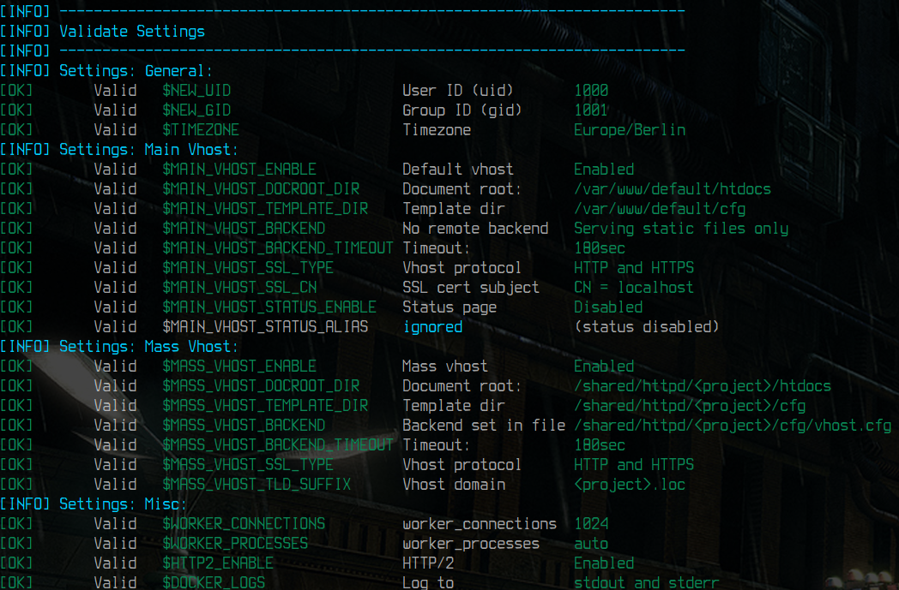
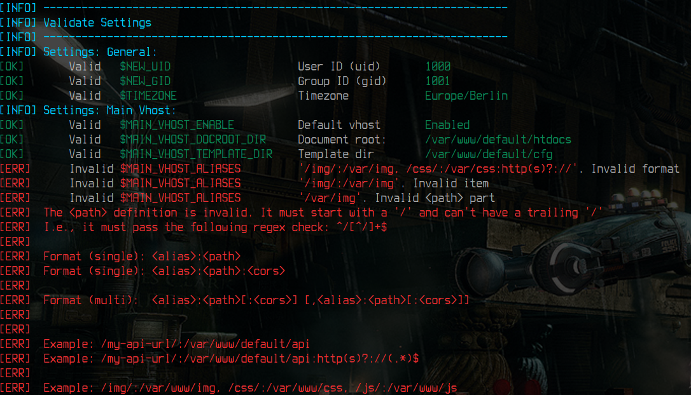
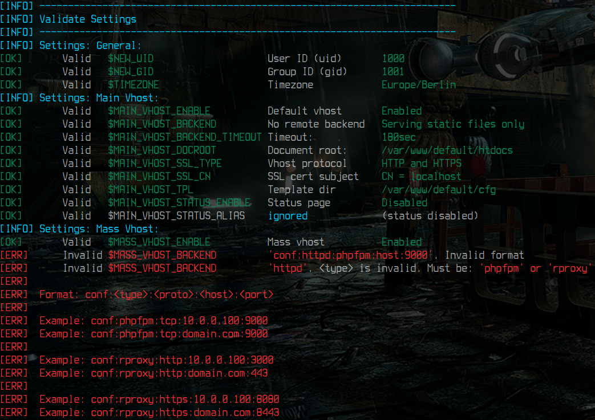
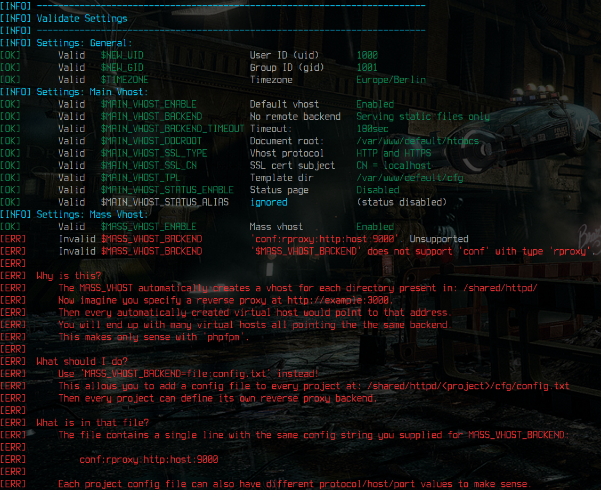
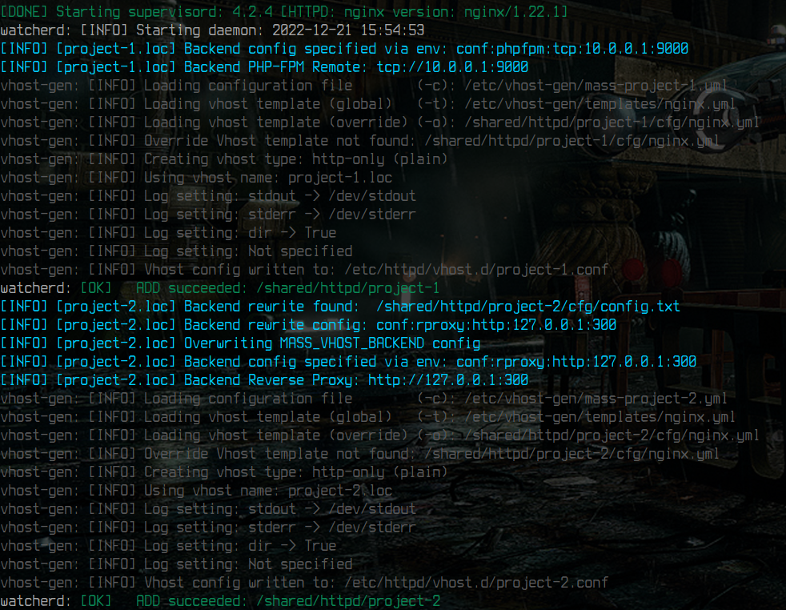

[Architecture](architecture.md) |
[Features](features.md) |
[Examples](examples.md) |
**Environment variables** |
[Volumes](volumes.md)

---

# Documentation: Environment Variables


The provided Docker images have a lot of injectables in order to customize it to your needs. Click an environment variable in the table below to jump to the corresponding section.

<table>
 <tr valign="top" style="vertical-align:top">
  <td>
   <strong>Verbosity</strong><br/>
   <code><a href="#-debug_entrypoint" >DEBUG_ENTRYPOINT</a></code><br/>
   <code><a href="#-debug_runtime" >DEBUG_RUNTIME</a></code><br/>
  </td>
  <td>
   <strong>System</strong><br/>
   <code><a href="#-new_uid" >NEW_UID</a></code><br/>
   <code><a href="#-new_gid" >NEW_GID</a></code><br/>
   <code><a href="#-timezone" >TIMEZONE</a></code><br/>
  </td>
  <td>
   <strong>Nginx</strong><br/>
   <code><a href="#-worker_connections" >WORKER_CONNECTIONS</a></code><br/>
   <code><a href="#-worker_processes" >WORKER_PROCESSES</a></code><br/>
  </td>
 </tr>
 <tr valign="top" style="vertical-align:top">
  <td>
   <strong>Main Vhost</strong><br/>
   <code><a href="#-main_vhost_enable" >MAIN_VHOST_ENABLE</a></code><br/>
   <code><a href="#-main_vhost_aliases_allow" >MAIN_VHOST_ALIASES_ALLOW</a></code><br/>
   <code><a href="#-main_vhost_aliases_deny" >MAIN_VHOST_ALIASES_DENY</a></code><br/>
   <code><a href="#-main_vhost_backend" >MAIN_VHOST_BACKEND</a></code><br/>
   <code><a href="#-main_vhost_backend_timeout" >MAIN_VHOST_BACKEND_TIMEOUT</a></code><br/>
   <code><a href="#-main_vhost_docroot_dir" >MAIN_VHOST_DOCROOT_DIR</a></code><br/>
   <code><a href="#-main_vhost_template_dir" >MAIN_VHOST_TEMPLATE_DIR</a></code><br/>
   <code><a href="#-main_vhost_ssl_type" >MAIN_VHOST_SSL_TYPE</a></code><br/>
   <br/>
   <code><a href="#-main_vhost_ssl_cn" >MAIN_VHOST_SSL_CN</a></code><br/>
   <code><a href="#-main_vhost_status_enable" >MAIN_VHOST_STATUS_ENABLE</a></code><br/>
   <code><a href="#-main_vhost_status_alias" >MAIN_VHOST_STATUS_ALIAS</a></code><br/>
  </td>
  <td>
   <strong>Mass Vhost</strong><br/>
   <code><a href="#-mass_vhost_enable" >MASS_VHOST_ENABLE</a></code><br/>
   <code><a href="#-mass_vhost_aliases_allow" >MASS_VHOST_ALIASES_ALLOW</a></code><br/>
   <code><a href="#-mass_vhost_aliases_deny" >MASS_VHOST_ALIASES_DENY</a></code><br/>
   <code><a href="#-mass_vhost_backend" >MASS_VHOST_BACKEND</a></code><br/>
   <code><a href="#-mass_vhost_backend_timeout" >MASS_VHOST_BACKEND_TIMEOUT</a></code><br/>
   <code><a href="#-mass_vhost_docroot_dir" >MASS_VHOST_DOCROOT_DIR</a></code><br/>
   <code><a href="#-mass_vhost_template_dir" >MASS_VHOST_TEMPLATE_DIR</a></code><br/>
   <code><a href="#-mass_vhost_ssl_type" >MASS_VHOST_SSL_TYPE</a></code><br/>
   <br/>
   <code><a href="#-mass_vhost_backend_rewrite" >MASS_VHOST_BACKEND_REWRITE</a></code><br/>
   <code><a href="#-mass_vhost_tld_suffix" >MASS_VHOST_TLD_SUFFIX</a></code><br/>
  </td>
  <td>
   <strong>All Vhosts</strong><br/>
   <code><a href="#-docker_logs" >DOCKER_LOGS</a></code><br/>
   <code><a href="#-http2_enable" >HTTP2_ENABLE</a></code><br/>
  </td>
 </tr>
</table>


## ∑ `DEBUG_ENTRYPOINT`

This variable controls the debug level (verbosity) for the container startup. The more verbose, the more information is shown via docker logs during startup.

* **Default:** `2`
* **Allowed:** `0`, `1`, `2`, `3`, `4`
* **Var type:** `int`

When set to `0`, the following events are shown: `error`<br/>
When set to `1`, the following events are shown: `error`,`warning`<br/>
When set to `2`, the following events are shown: `error`, `warning`, `ok`, `info`<br/>
When set to `3`, the following events are shown: `error`, `warning`, `ok`, `info`, `debug`<br/>
When set to `4`, the following events are shown: `error`, `warning`, `ok`, `info`, `debug` and `trace`


## ∑ `DEBUG_RUNTIME`

This variable controls the debug level (verbosity) during run-time (after validation and after the main webserver process has started).

* **Default:** `1`
* **Allowed:** `0`, `1`, `2`
* **Var type:** `int`

When set to `0`, the following events are shown: none<br/>
When set to `1`, the following events are shown: `command outputs`<br/>
When set to `2`, the following events are shown: `command outputs` and `commands`

If you are using dynamic vhost creation with `MASS_VHOST_ENABLE=1`, it is recommended to keep this value at `1`, in order to observe the correct creation/deletion and view any custom templates being picked up.


## ∑ `NEW_UID`

This variable controls the user id of the webserver process.

* **Default:** ``
* **Allowed:** any valid user id (use your local users' `uid`)
* **Var type:** `int`

> **Backgrund:** The webserver docker image has a non-root user (and group) that the webserver process runs with. When one of your PHP scripts creates a file (cache, uploads, etc), it is being created with the user id and group id, the webserver process runs with. In order to make sure this is the same user id as your normal user locally on the host system, this env variable can be used to change the user id inside the container (during startup).
**Why can't the webserver process run as root?** It would then create files with root permissions and as those files are actually on your host system, you would require root permission to access/edit them again.
>
> You can read more about this topic here: [Syncronize file and folder Permissions](https://github.com/devilbox/docker-php-fpm/blob/master/doc/syncronize-file-permissions.md).

What value should I set this to? Open up a terminal on your host system and type **`id -u`** to find out the user id of your local user.


## ∑ `NEW_GID`

This variable controls the group id of the webserver process.

* **Default:** ``
* **Allowed:** any valid group id (use your local users' `gid`)
* **Var type:** `int`

> See **`NEW_UID`** for background information.

What value should I set this to? Open up a terminal on your host system and type **`id -g`** to find out the group id of your local user.


## ∑ `TIMEZONE`

This variable sets the timezone for the container as well as for the webserver process.

* **Default:** `UTC`
* **Allowed:** any valid timezone (e.g.: `Europe/Berlin`)
* **Var type:** `string`


## ∑ `MAIN_VHOST_ENABLE`

This variable controls whether the main (default) virtual host is enabled or disabled.

* **Default:** `1`
* **Allowed:** `0` or `1`
* **Var type:** `bool`


## ∑ `MAIN_VHOST_DOCROOT_DIR`

The given directory name (not path) is appended to the vhost base path. This is the final location from where the main (default) vhost will serve files from.

* **Default:** `htdocs`
* **Allowed:** valid directory name (not path)
* **Var type:** `string`
* **Requires:** `MAIN_VHOST_ENABLE=1`

The given directory name will be appended to the current web server base path (`/var/www/default/`) and thus creating the full path from where the main (default) vhost will serve files from (`DocumentRoot` in _Apache speak_ or `root` in _Nginx speak_).

**Example:**

| `MAIN_VHOST_DOCROOT_DIR` value | Full path where the main (default) vhost serves files from |
|--------------------------------|------------------------------------------------------------|
| `htdocs`                       | `/var/www/default/htdocs/`                                 |
| `www`                          | `/var/www/default/www/`                                    |

The following Docker logs output shows settings for `*_VHOST_DOCROOT_DIR` set to `htdocs`




## ∑ `MAIN_VHOST_TEMPLATE_DIR`

The given directory name (not path) is appended to the vhost base path. This is the final location in which [vhost-gen](https://github.com/devilbox/vhost-gen/) will look for custom templates for the main (default) vhost creation.

* **Default:** `cfg`
* **Allowed:** valid directory name
* **Var type:** `string`
* **Requires:** `MAIN_VHOST_ENABLE=1`

The given directory name will be appended to the current web server base path (`/var/www/default/`) and thus creating the full path in which `vhost-gen` will look for custom templates.


**Example:**

| `MAIN_VHOST_TEMPLATE_DIR` value | Full path where `vhost-gen` will look for templates   |
|----------------------------|------------------------------------------------------------|
| `cfg`                      | `/var/www/default/cfg/`                                    |
| `.conf`                    | `/var/www/default/.conf/`                                  |

The following Docker logs output shows settings for `*_VHOST_TEMPLATE_DIR` set to `cfg`. See how it affects the `MASS_VHOST_BACKEND` as well.


**Note:** In most cases it is not required to mess with the `vhost-gen` templates, but if you want some major customizations, download the **[vhost-gen templates](https://github.com/devilbox/vhost-gen/tree/master/etc/templates)**, adjust it and put it into the directory prior startup (via mount).


## ∑ `MAIN_VHOST_ALIASES_ALLOW`

This variable defines one or more URL aliases pointing to a file system path. Optional CORS settings can be set as well.

* **Default:** `` _(no aliases)_
* **Allowed:** valid aliases string
* **Var type:** `string`
* **Requires:** `MAIN_VHOST_ENABLE=1`

### Format string
```bash
# Single alias
<alias>:<path>[:<cors>]

# Multiple aliases are comma separated
<alias>:<path>[:<cors>][,<alias>:<path>[:<cors>]]
```

### Format string examples
```bash
# Single alias
# Ensures that http://server/url/path/ points to filesystem /var/www/default/img
/url/path/:/var/www/default/img

# Single alias with CORS
# Ensures that http://server/url/path/ points to filesystem /var/www/default/img
# And allows cross domain request from these hosts: http(s)?://(.+)?
/url/path/:/var/www/default/img:http(s)?://(.+)$

# Mutiple aliases
# Ensures that http://server/devilbox-api/ points to filesystem /var/www/default/api
# Ensures that http://server/vhost.d/      points to filesystem /etc/httpd
/devilbox-api/:/var/www/default/api, /vhost.d/:/etc/httpd

# Mutiple aliases with CORS
# Ensures that http://server/devilbox-api/ points to filesystem /var/www/default/api
# Ensures that http://server/vhost.d/      points to filesystem /etc/httpd
# And allows cross domain request from these hosts: http(s)?://(.+)? on http://server/devilbox-api/
/devilbox-api/:/var/www/default/api:http(s)?://(.+)$, /vhost.d/:/etc/httpd
```

### Generation example

Let's assume you have provided the following environment variable to the docker image:
```bash
MAIN_VHOST_ALIASES_ALLOW='/vhost.d/:/etc/httpd'
```
In _Nginx Speak_ it would generate the following configuration block:
```conf
location ~ /vhost.d/ {
    root  /etc/httpd;
}
```
In _Apache Speak_ it would generate the following configuration block:
```conf
Alias "/vhost.d/" "/etc/httpd/vhost.d/"
<Location "/vhost.d/">
</Location>
<Directory "/etc/httpd/vhost.d/">
    Order allow,deny
    Allow from all
    Require all granted
</Directory>
```

### Validation

During docker startup, the entrypoint validator tries the best guess on what has gone wrong and gives valid examples.




## ∑ `MAIN_VHOST_ALIASES_DENY`

This variable defines one or more URL aliases to deny access to.

* **Default:** `/\.git, /\.ht.*`
* **Allowed:** valid aliases string
* **Var type:** `string`
* **Requires:** `MAIN_VHOST_ENABLE=1`

### Format string
```bash
# Single alias
<alias>

# Multiple aliases
<alias>,<alias>
```
### Format string examples
```bash
# Single alias
# Ensures that http://server/url/secret is denied
/url/secret*

# Mutiple aliases
# Ensures that http://server/.git is denied
# Ensures that http://server/.svn is denied
/\.git, /\.svn
```

### Generation example

Let's assume you have provided the following environment variable to the docker image:
```bash
MAIN_VHOST_ALIASES_DENY='/\.git, /\.ht.*'
```
In _Nginx Speak_ it would generate the following configuration block:
```conf
# Deny Definition
location ~ /\.git {
    deny all;
}
# Deny Definition
location ~ /\.ht.* {
    deny all;
}
```
In _Apache Speak_ it would generate the following configuration block:
```conf
# Deny Definition
<FilesMatch "/\.git">
    Order allow,deny
    Deny from all
</FilesMatch>

# Deny Definition
<FilesMatch "/\.ht.*">
    Order allow,deny
    Deny from all
</FilesMatch>
```


## ∑ `MAIN_VHOST_BACKEND`

The given value determines the backend (potentia remote/reveres hosts) for the main (default vhost).

* **Default:** `` _(serving static files only)_
* **Allowed:** valid backend string
* **Var type:** `string`
* **Requires:** `MAIN_VHOST_ENABLE=1`

You can configure a remote backend via this environment variable. Either a remote PHP-FPM server or any kind of service via `http`, `https`, `ws`, or `wss` reverse proxy (where `ws` and `wss` are for websocket backends).

### String format

The backend environment variable supports two different formats.

1. Direct configuration
    ```bash
    conf:<type>:<protocol>:<host>:<port>
    ```
2. Configuration via file
    ```bash
    file:<filename>
    ```

### 1. Direct configuration

With the direct configuration you set everything explicitly via this environment variable and nothing else is required.

* **`<type>`**: `phpfpm` or `rproxy`
* **`<protocol>`**: `tcp`, `http`, `https`, `ws` or `wss`
* **`<host>`**: the address of upstream host to send requests to (`hostname`, `IPv4` or `IPv6`).
* **`<port>`**: the port of the upstream host to send requests to

**Examples**
```bash
MAIN_VHOST_BACKEND=conf:phpfpm:tcp:10.0.0.1:9000
MAIN_VHOST_BACKEND=conf:rproxy:http:10.0.0.1:3000
MAIN_VHOST_BACKEND=conf:rproxy:https:10.0.0.1:3000
MAIN_VHOST_BACKEND=conf:rproxy:ws:10.0.0.1:3000
MAIN_VHOST_BACKEND=conf:rproxy:wss:10.0.0.1:3000
```

When specifying `phpfpm`, the vhost will also automatically be configured for serving PHP files. (including `index.php` for its directory index).

### 2. Configuration via file

With the file configuration, you assign the configuration for the vhost a file instead of its environment variable.
The file will be located in the vhost base path under `$MAIN_VHOST_TEMPLATE_DIR`.

The main (default) vhost base path is `/var/www/default`. Now let's assume the following configuration:
* `MAIN_VHOST_TEMPLATE_DIR=cfg`
* `MAIN_VHOST_BACKEND=file:backend.cfg`

The configuration file can then be found in `/var/www/default/cfg/backend.cfg`.

The file expects the same string as you would give to the format in `Direct configuration`.

**Example:**
```bash
$ cat /var/www/default/cfg/backend.cfg
conf:phpfpm:tcp:10.0.0.1:9000
```

See the following Docker logs output for how `*_VHOST_TEMPLATE_DIR` affects the configuration file specified in `*_VHOST_BACKEND`<br/>


### Validation

During docker startup, the entrypoint validator tries the best guess on what has gone wrong and gives valid examples.

|  |  |
|:-----------:|:-----------:|
| Invalid `<type>` | Unsupported backend |


## ∑ `MAIN_VHOST_BACKEND_TIMEOUT`

Set a timeout for the backend server (if any was specified).

* **Default:** `180`
* **Allowed:** valid integer
* **Var type:** `integer`
* **Requires:** `MAIN_VHOST_ENABLE=1` and `MAIN_VHOST_BACKEND=...`

The given value determines the timeout (in seconds) for the backend, if a backend was set via `MAIN_VHOST_BACKEND`


## ∑ `MAIN_VHOST_SSL_TYPE`

The SSL_TYPE determines if HTTPS vhosts are created and how they behave.

* **Default:** `plain`
* **Allowed:** `plain`, `ssl`, `both`, `redir`
* **Var type:** `string`
* **Requires:** `MAIN_VHOST_ENABLE=1`

By default only a HTTP vhost is created, you can change this via the SSL type:

* `MAIN_VHOST_SSL_TYPE=plain`: Only a HTTP vhost is created
* `MAIN_VHOST_SSL_TYPE=ssl`: Only a HTTPS vhost is created
* `MAIN_VHOST_SSL_TYPE=both`: A HTTP and a HTTPS vhost is created
* `MAIN_VHOST_SSL_TYPE=redir`: Any HTTP request redirects to HTTPS (where the vhost resides)


## ∑ `MAIN_VHOST_SSL_CN`

Set the Common name for the SSL certificate of the vhost.

* **Default:** `localhost`
* **Allowed:** valid common name
* **Var type:** `string`
* **Requires:** `MAIN_VHOST_ENABLE=1` and `MAIN_VHOST_SSL_TYPE != plain`

If you want to set the common name of the SSL certificate for this vhost to something else than `localhost`, then adjust it here.


## ∑ `MAIN_VHOST_STATUS_ENABLE`

You can enable the webserver status page with this variable

* **Default:** `0`
* **Allowed:** `0` or `1`
* **Var type:** `bool`
* **Requires:** `MAIN_VHOST_ENABLE=1`

When setting to `1`, the webserver status page will be available under the URL specified in `MAIN_VHOST_STATUS_ALIAS`.


## ∑ `MAIN_VHOST_STATUS_ALIAS`

Change the location of the webserver status URL.

* **Default:** `/httpd-status`
* **Allowed:** valid alias string
* **Var type:** `string`
* **Requires:** `MAIN_VHOST_ENABLE=1` and `MAIN_VHOST_STATUS_ENABLE`

By default, you can access the webserver status page via `http(s)?://<HOST>:<PORT>/httpd-status`.
If you would like a different URL, change it here.


## ∑ `MASS_VHOST_ENABLE`

See [`MAIN_VHOST_ENABLE`](#-main_vhost_enable). It is the same concept.


## ∑ `MASS_VHOST_DOCROOT_DIR`

See [`MAIN_VHOST_DOCROOT_DIR`](#-main_vhost_docroot_dir). It is the same concept.


## ∑ `MASS_VHOST_TEMPLATE_DIR`

See [`MAIN_VHOST_TEMPLATE_DIR`](#-main_vhost_template_dir). It is the same concept.


## ∑ `MASS_VHOST_ALIASES_ALLOW`

See [`MAIN_VHOST_ALIASES_ALLOW`](#-main_vhost_aliases_allow). It is the same concept.


## ∑ `MASS_VHOST_ALIASES_DENY`

See [`MAIN_VHOST_ALIASES_DENY`](#-main_vhost_aliases_deny). It is the same concept.


## ∑ `MASS_VHOST_BACKEND`

See [`MAIN_VHOST_BACKEND`](#-main_vhost_backend). It is the same concept.


## ∑ `MASS_VHOST_BACKEND_REWRITE`

This is a per project backend overwrite that is accomplished through a configuration file inside the project directory.

* **Default:** ``
* **Allowed:** `file:<file>`
* **Var type:** `string`
* **Requires:** `MASS_VHOST_ENABLE=1` and a value in `MASS_VHOST_BACKEND`

This environment variable works in the same way as [`MAIN_VHOST_BACKEND`](#-main_vhost_backend) with the exception that it only supports the `file:<file>` format.

### Why would I use this?

You can first set a generic backend for mass virtual hosting via `MASS_VHOST_BACKEND`. That means that every created mass virtual host will use the defined backend as its default (e.g. PHP-FPM).
Now if you have a single (or more) project, which requires a different configuration (e.g. needs to be a reverse proxy), then you can place a configuration file (as specified in `MASS_VHOST_BACKEND_REWRITE`) into that project dir and its backend will behave in this way.

You can see an example setup here, with `MASS_VHOST_BACKEND=conf:phpfpm:tcp:10.0.0.1:9000` and `MASS_VHOST_BACKEND_REWRITE=file:config.txt`, where the `config.txt` contains: `conf:rproxy:http:127.0.0.1:300`



### What are the limitations?

`MASS_VHOST_BACKEND_REWRITE` only works, if you are also using `MASS_VHOST_BACKEND`. I.e, you must have something that you can rewrite, otherwise there is no sense in using it and you can just fall back to using `MASS_VHOST_BACKEND` alone. Don't worry too much about it, the entrypoint validator will tell you in case you got this wrong.

Additionally there is no such thing as `MAIN_VHOST_BACKEND_REWRITE`, as the main vhost is only a single vhost and therefore has no need to overwrite it, as you can simply use `MAIN_VHOST_BACKEND`.


## ∑ `MASS_VHOST_BACKEND_TIMEOUT`

See [`MAIN_VHOST_BACKEND_TIMEOUT`](#-main_vhost_backend-timeout). It is the same concept.


## ∑ `MASS_VHOST_SSL_TYPE`

See [`MASS_VHOST_SSL_TYPE`](#-main_vhost_ssl-type). It is the same concept.


## ∑ `MASS_VHOST_TLD_SUFFIX`

Set the domain suffix for all virtual hosts created via the `MASS_VHOST_ENABLE`.

* **Default:** `.loc`
* **Allowed:** empty or domain with leading dot
* **Var type:** `str`
* **Requires:** `MASS_VHOST_ENABLE=1`


**Background:** When `MASS_VHOST_ENABLE` is set to `1`. [watcherd](https://github.com/devilbox/watcherd) will listen for directory changes (creations, deletions, renamings) in `/shared/httpd`. As soon as a project directory is created below that path, `watcherd` will trigger [vhost-gen](https://github.com/devilbox/vhost-gen/) to create a new virtual host and reloads the webserver.

Each project virtual host created will have a name of `<DIRECTORY_NAME>${MASS_VHOST_TLD_SUFFIX}`. See the table below for details:

| Base path        | Project dir | MASS_VHOST_TLD_SUFFIX | Final domain name     |
|------------------|-------------|-----------------------|-----------------------|
| `/shared/httpd/` | `test-1`    | ``                    | `test-1`              |
| `/shared/httpd/` | `test-1`    | `.loc`                | `test-1.loc`          |
| `/shared/httpd/` | `drupal`    | `.com`                | `drupal.com`          |
| `/shared/httpd/` | `nodeapp`   | `example.com`         | `nodeapp.example.com` |

If you have SSL enabled, then the final domain name will also be used as the common name for SSL certificate generation for the project.


## ∑ `DOCKER_LOGS`

This variable controls whether webserver access and error logs are written to a log file inside the container or shown via docker logs.

* **Default:** `1`
* **Allowed:** `0` or `1`
* **Var type:** `bool`

By default (value: `1`) all Docker images are configured to output their webserver access and error logs to stdout and stderr, which means it is shown by `docker logs` (or `docker-compose logs`).

If you want to log into files inside the container instead, change it to `0`. The respective log files are available in `/var/log/httpd/` and can be mounted to your local file system so you can `cat`, `tail` or `grep` them for anything interesting.


## ∑ `HTTP2_ENABLE`

Globally enable/disable `HTTP2` protocol.

* **Default:** `1`
* **Allowed:** `0` or `1`
* **Var type:** `bool`

When set to `1`, all virtual hosts will allow the HTTP2 protocol.
When set to `0`, all virtual hosts will disallow the HTTP2 protocol.


## ∑ `WORKER_CONNECTIONS`

Set Nginx worker.connections.

* **Default:** `1024`
* **Allowed:** valid number
* **Var type:** `integer`

See Nginx documentation: [worker_connections](https://nginx.org/en/docs/ngx_core_module.html#worker_connections).


## ∑ `WORKER_PROCESSES`

Set Nginx worker.processes.

* **Default:** `auto`
* **Allowed:** valid value
* **Var type:** `string` or `int`

See Nginx documentation: [worker_processes](https://nginx.org/en/docs/ngx_core_module.html#worker_processes).
